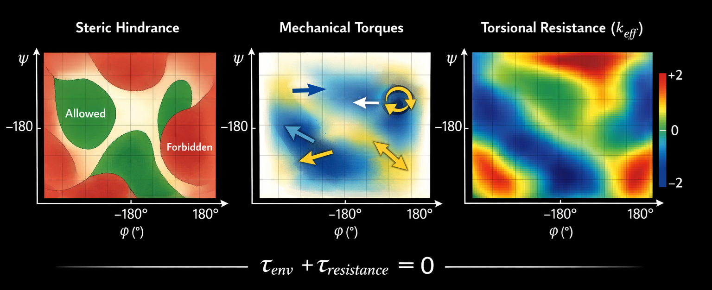
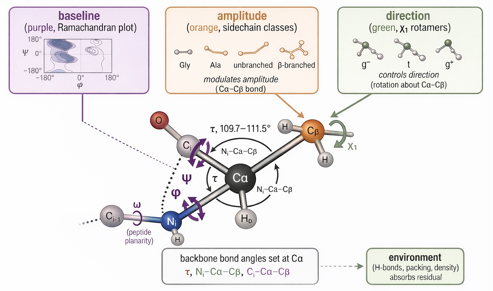
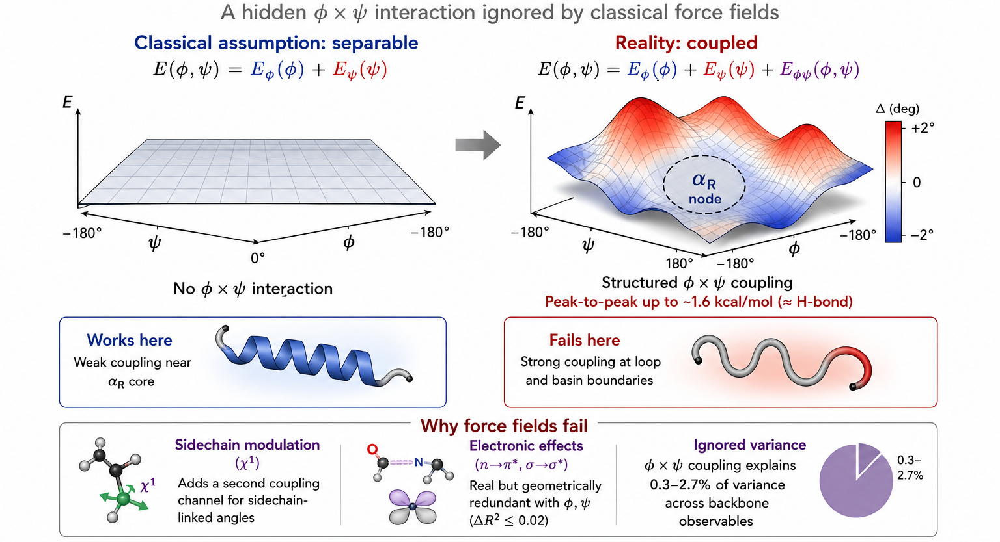
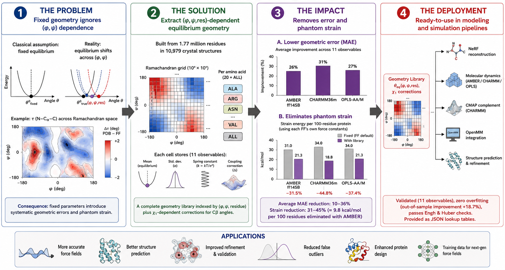

HEAD
# Protein Backbone Geometry: A Four-Paper Series

[](LICENSE)
[](https://www.python.org/downloads/)
[](#dataset)

**A complete framework for understanding and correcting protein backbone geometry, from first-principles mechanics to a practical force-field correction library.**

Wei Chen, Urška Cvek, Marjan Trutschl  
Department of Computer Science, Louisiana State University Shreveport

---

## Overview

This repository contains the data, code, and geometry library for a four-paper series that reinterprets protein backbone geometry as a mechanical system and delivers a practical correction to molecular mechanics force fields.

| Paper | Title | Key Finding |
|:---:|---|---|
| **1** | [Protein Backbone Geometry as Local Mechanical Equilibrium](#paper-1) | The Ramachandran plot is a force field, not a population census |
| **2** | [Backbone Bond Angles Deform Systematically with (φ,ψ)](#paper-2) | τ varies by 8.4° across Ramachandran space via a three-channel mechanical hierarchy |
| **3** | [The Coupling Structure of Protein Backbone Geometry](#paper-3) | φ×ψ coupling adds 2–3% variance; QM corrections are geometrically redundant |
| **4** | [A Conformation-Dependent Geometry Library](#paper-4) | Drop-in replacement for fixed constants; reduces phantom strain by 31.5% |

### Key Insights

*Figure 1: The 3-layer mechanical model of backbone geometry.*

*Figure 2: The three-channel mechanical hierarchy showing how $N-C\alpha-C$ ($\tau$) bond angles vary systematically with $(\phi, \psi)$*

*Figure 3: Analysis of $\phi \times \psi$ coupling and the geometric redundancy of quantum mechanical corrections.*

*Figure 4: Performance of the CDL as a drop-in replacement, demonstrating the reduction in phantom strain.*

**The central deliverable is the geometry library** — a lookup table that replaces the fixed bond lengths and bond angles used in AMBER, CHARMM, OPLS, and NeRF reconstruction with conformation-dependent values derived from 1.77 million residues.

---

## Quick Start

### Installation

```bash
git clone https://github.com/wei09128/protein-backbone-geometry.git
cd protein-backbone-geometry
pip install numpy  # only dependency
```

### Basic Usage

```python
from backbone_geometry_library import GeometryLibrary

lib = GeometryLibrary()

# Look up geometry for alanine in α-helix
geom = lib.get(phi=-63, psi=-43, residue='ALA')
print(f"τ = {geom['tau']:.1f}°")         # 111.0° (vs AMBER's fixed 111.1°)
print(f"N-Cα = {geom['bond_NCA']:.3f} Å") # 1.460 Å (vs AMBER's fixed 1.458 Å)

# Look up geometry for valine in β-sheet
geom = lib.get(phi=-120, psi=130, residue='VAL')
print(f"τ = {geom['tau']:.1f}°")          # 109.6° (AMBER would say 111.1°)
```

### Command-Line Query

```bash
# Single residue
python backbone_geometry_library.py --phi -63 --psi -43 --residue GLY --compare

# All 20 amino acids at a given position
python backbone_geometry_library.py --phi -120 --psi 130 --all_residues
```

### OpenMM Force-Field Integration

```python
from openmm.app import PDBFile, ForceField
from backbone_geometry_library import apply_corrections

pdb = PDBFile('protein.pdb')
ff = ForceField('amber14-all.xml', 'amber14/tip3pfb.xml')
system = ff.createSystem(pdb.topology)

# One line to correct all backbone angle equilibria:
system = apply_corrections(system, pdb.topology, pdb.positions,
                           force_field='amber')  # or 'charmm' or 'opls'
```

---

## Repository Structure

```
protein-backbone-geometry/
│
├── README.md                          # This file
├── LICENSE                            # MIT License
│
├── library/                           # ★ The geometry library (Paper 4)
│   ├── constants_library.json         # Main library: 745 cells × 21 classes × 12 observables
│   ├── constants_chi1.json            # χ₁-dependent Cβ angle corrections (2,425 entries)
│   ├── backbone_geometry_library.py   # Python module with full API
│   └── README_LIBRARY.md              # Detailed library documentation
│
├── scripts/ # Analysis scripts
│
│   # paper1  Ramachandran as mechanical force field
│   ├── paper1_1_collect_backbone_features.py      # Extract φ,ψ + local geometry from PDB
│   ├── paper1_2_backbone_analysis.py              # Ramachandran density + stiffness maps
│   ├── paper1_3_subgroup_projection_analysis.py   # PCA/projection of conformation subgroups
│   ├── paper1_4_subgroup_k_analysis.py            # Per-subgroup spring constant estimation
│   ├── paper1_5_ff_correction.py                  # Force-field equilibrium correction terms
│   ├── paper1_5_ff_curvature_comparison.py        # Curvature comparison across FF families
│   ├── paper1_6_spring_consistency_analysis.py    # Cross-residue spring constant consistency
│   ├── paper1_99_test_torque_logic.py             # Unit tests for torque derivation
│   ├── paper1_99_use_lj_torques.py                # Lennard-Jones torque sensitivity analysis
│
│   # paper2  Bond angles deform with (φ,ψ)
│   ├── paper2_pdb_loader.py                       # PDB fetch, parse, and residue filtering
│   ├── paper2_molcore.py                          # Core geometry calculations (bonds, angles)
│   ├── paper2_geom_utils.py                       # Shared dihedral/angle utility functions
│   ├── paper2_features_collector.py               # Batch feature extraction across PDB set
│   ├── paper2_hbond_finder.py                     # Hydrogen bond detection for SS assignment
│   ├── paper2_nerf_builder.py                     # NeRF coordinate reconstruction pipeline
│   ├── paper2_generate_fixtures.py                # Generate test fixtures / reference data
│   ├── paper2_01a_tau_map.py                      # τ (∠N-Cα-C) Ramachandran heat map
│   ├── paper2_01b_tau_by_residue.py               # Per-residue τ variation across φ,ψ
│   ├── paper2_02_angle_universality.py            # Universality test: all 6 backbone angles
│   ├── paper2_03_sidechain_scatter.py             # Cβ angle scatter vs φ,ψ
│   ├── paper2_04_sidechain_channel.py             # Sidechain channel effect on backbone angles
│   ├── paper2_05_rotamer_per_residue.py           # χ₁ rotamer stratification per residue
│   ├── paper2_06_val_anomaly.py                   # Val/Ile β-branching anomaly analysis
│   ├── paper2_07_residual_regression.py           # Residual regression after φ,ψ correction
│   ├── paper2_08_bond_length_scoping.py           # Bond length variation across φ,ψ
│   ├── paper2_08_resolution_stratified.py         # Resolution-stratified geometry validation
│   ├── paper2_supp_stiffness_hierarchy.py         # Supplementary: angle stiffness hierarchy
│   ├── paper2_f1_assembly.py                      # Figure 1 panel assembly
│   ├── paper2_f2_assembly.py                      # Figure 2 panel assembly
│   ├── paper2_f3_assembly.py                      # Figure 3 panel assembly
│
│   # paper3  Coupling structure
│   ├── paper3_01_npi_star_geometry.py             # n→π* orbital overlap extraction
│   ├── paper3_02_hyperconjugation.py              # σ→σ* hyperconjugation geometry
│   ├── paper3_03_coupling_decomposition.py        # Two-way ANOVA decomposition
│   ├── paper3_04_wall_sign_change.py              # Sign-change test at steric walls
│   ├── paper3_05_comprehensive.py                 # Resolution, per-residue, SS, energy analyses
│   ├── paper3_06_gam_coupling.py                  # GAM-based corrected decomposition
│
│   # paper4  Geometry library
│   ├── paper4_01_constant_library.py              # Library extraction
│   ├── paper4_02_nerf_integration.py              # NeRF benchmark
│   ├── paper4_03_local_benchmark.py               # Local geometry benchmark
│   ├── paper4_04_patch_library.py                 # ω fix + reliability flags
│   ├── paper4_05_fair_benchmarks.py               # Strain energy + temporal split
│   ├── paper4_06_strain_plot.py                   # Figure generation
│   ├── paper4_07_ff_integration.py                # AMBER/CHARMM/OPLS comparison
│   ├── integration/
│   │   ├── paper4_99_apply_library_corrections.py # OpenMM integration script
│   │   └── library_correction.frcmod             # AMBER parameter file
│
├── figures/
│
├── manuscript/
│
└── data/

```

---

## The Geometry Library

### What It Contains

For each 10° × 10° cell on the Ramachandran plane, for each of 21 residue classes (20 amino acids + pooled ALL), the library stores:

| Field | Description | Example |
|---|---|---|
| `tau_deg_eq` | Equilibrium τ (∠N–Cα–C) | 111.6° |
| `angle_N_CA_CB_eq` | Equilibrium ∠N–Cα–Cβ | 110.3° |
| `angle_C_CA_CB_eq` | Equilibrium ∠C–Cα–Cβ | 110.1° |
| `angle_CaCN_eq` | Equilibrium ∠Cα–C–N | 116.7° |
| `angle_CNCa_eq` | Equilibrium ∠C–N–Cα | 121.4° |
| `angle_CA_C_O_eq` | Equilibrium ∠Cα–C=O | 120.4° |
| `bond_N_CA_eq` | N–Cα bond length | 1.460 Å |
| `bond_CA_C_eq` | Cα–C bond length | 1.524 Å |
| `bond_C_O_eq` | C=O bond length | 1.232 Å |
| `bond_C_N_next_eq` | C–N peptide bond | 1.333 Å |
| `bond_CA_CB_eq` | Cα–Cβ bond length | 1.534 Å |
| `*_std` | Standard deviation | 1.8° |
| `*_k` | Empirical spring constant (kT/σ²) | 600 kcal/mol/rad² |
| `*_coupling` | Paper 3 coupling correction | +0.45° |

### Who Uses What

| User | Files Needed | Example |
|---|---|---|
| **NeRF developer** | `backbone_geometry_library.py` + `constants_library.json` | Replace fixed constants with `lib.get(phi, psi, residue)` |
| **MD researcher** (OpenMM) | All three files | `apply_corrections(system, topology, positions)` |
| **MD researcher** (AMBER native) | `library_correction.frcmod` | Load as additional parameter file |
| **Structural biologist** | `constants_library.json` | Query expected geometry for validation |
| **ML force-field developer** | `constants_library.json` + `constants_chi1.json` | Training targets for geometry prediction |

### API Reference

```python
from backbone_geometry_library import GeometryLibrary

lib = GeometryLibrary('path/to/constants_library.json')

# Get everything for one residue
geom = lib.get(phi=-63, psi=-43, residue='ALA')
# Returns: {'tau': 111.0, 'angle_NCaCB': 110.3, 'bond_NCA': 1.460, ...}

# Get specific observables
tau = lib.get_tau(phi=-63, psi=-43, residue='GLY')           # 113.1°
bonds = lib.get_bonds(phi=-120, psi=130, residue='VAL')      # {'NCA': 1.459, ...}
angles = lib.get_angles(phi=-63, psi=-43, residue='ALA')     # {'N_CA_C': 111.0, ...}
omega = lib.get_omega(phi=-63, psi=-43, residue='ALA')       # 179.8°

# χ₁-dependent Cβ correction
corr = lib.get_chi1_correction(phi=-63, psi=-43, residue='VAL', chi1_rotamer='t')
# Returns: {'N_CA_CB': 109.8, 'C_CA_CB': 110.5}

# Fallback chain: specific AA → ALL → AMBER defaults
# Always returns a value, never fails
```

### OpenMM Integration (Detailed)

```python
from openmm.app import PDBFile, ForceField, Simulation, PME
from openmm import LangevinMiddleIntegrator, unit
from backbone_geometry_library import apply_corrections

# 1. Standard setup
pdb = PDBFile('protein.pdb')
ff = ForceField('amber14-all.xml', 'amber14/tip3pfb.xml')
system = ff.createSystem(pdb.topology,
                         nonbondedMethod=PME,
                         constraints=None)

# 2. Apply library corrections (one line)
#    Works with: force_field='amber', 'charmm', or 'opls'
system = apply_corrections(
    system, pdb.topology, pdb.positions,
    library_path='constants_library.json',
    force_field='amber'
)
# Output: "backbone_geometry_library: added 284 angle corrections
#          (198 direct, 82 ALL fallback, 4 default fallback)"

# 3. Run simulation as normal
integrator = LangevinMiddleIntegrator(300*unit.kelvin, 1/unit.picosecond,
                                       0.002*unit.picoseconds)
sim = Simulation(pdb.topology, system, integrator)
sim.context.setPositions(pdb.positions)
sim.minimizeEnergy()
sim.step(50000)  # 100 ps
```

**What happens under the hood:**
1. Computes φ,ψ for each residue from the input coordinates
2. Looks up the library equilibrium value for each backbone angle
3. Adds a `CustomAngleForce` correction: `E = ½k(θ−θ_lib)² − ½k(θ−θ_FF)²`
4. This shifts the equilibrium from θ_FF to θ_lib without changing k

---

## Key Results

### Strain Energy Reduction

AMBER's fixed constants impose **9.8 kcal/mol of phantom strain per 100-residue protein** (≈7 hydrogen bonds). The library eliminates 31.5% of this strain.

| Force Field | Strain/residue | With Library | Reduction |
|---|---|---|---|
| AMBER ff14SB | 0.310 kcal/mol | 0.213 kcal/mol | −31.5% |
| CHARMM36m | 0.340 kcal/mol | 0.188 kcal/mol | −44.8% |
| OPLS-AA/M | 0.340 kcal/mol | 0.213 kcal/mol | −37.4% |

### Local Geometry Improvement

The library beats AMBER on **all 11 observables**:

| Observable | AMBER MAE | Library MAE | Improvement |
|---|---|---|---|
| τ (N–Cα–C) | 1.926° | 1.372° | **+28.8%** |
| ∠N–Cα–Cβ | 1.327° | 0.849° | **+36.1%** |
| bond Cα–Cβ | 0.0113 Å | 0.0081 Å | **+28.0%** |

### Zero Overfitting

80/20 temporal split: train improvement +16.7%, **test improvement +18.7%**, gap = −2.0%.
The library captures universal backbone physics, not dataset artifacts.

### Validation

- Engh & Huber crystallographic reference: **11/11 PASS** (all within 0.27σ)
- Physics constraint τ(β) < τ(αR): **PASS** (Δ = 2.47°)
- Bootstrap reliability: **9/12 observables reliable** (2 zeroed in release)

---

## Paper Summaries

### Paper 1
**Protein Backbone Geometry as Local Mechanical Equilibrium**

Reinterprets the Ramachandran plot as a mechanical force field. Force decomposition (R² = 0.88 for φ) reveals that steric torques dominate both dihedral axes with cross-axis Cα transmission. Three mechanical regimes: α-helices (steric confinement), β-sheets (persistence against gradient), PPII (chemistry-dependent). Two orthogonal steric walls at φ ≈ −60° and ψ ≈ −40° define the αR minimum as a mechanical trap.

### Paper 2
**Backbone Bond Angles Deform Systematically with (φ,ψ)**

Shows that backbone bond angles are not fixed but vary systematically: τ shifts by 8.4° peak-to-peak across Ramachandran space. A three-channel mechanical hierarchy: (1) backbone dihedrals set the baseline strain field, (2) sidechain identity and χ₁ rotamer modulate amplitude and direction through the Cα center, (3) non-local environment (H-bonds, packing) provides additional corrections for τ and ω.

### Paper 3
**The Coupling Structure of Protein Backbone Geometry**

Tests and quantifies the separability assumption E(φ,ψ) = E_φ(φ) + E_ψ(ψ). GAM decomposition shows φ×ψ coupling adds ΔR² = 2.1–2.7% beyond additive models, strongest in coil (2.3%) and weakest in PPII (0.5%). χ₁ adds a larger coupling channel for Cβ angles (ΔR² = 4.6%) than φ×ψ itself. n→π* and hyperconjugation are geometrically redundant (ΔR² ≤ 0.02). Coupling nodes coincide with Paper 1's steric walls.

### Paper 4
**A Conformation-Dependent Geometry Library for Protein Backbone Reconstruction**

Extracts, validates, and benchmarks a complete geometry library: 745 cells × 21 residue classes × 12 observables, plus 2,425 χ₁-dependent entries. Reduces MAE by 10–36% vs AMBER on all observables. Strain energy analysis: 9.8 kcal/mol phantom strain per 100 residues eliminated. Zero overfitting on temporal split. Integrates with AMBER (−31.5%), CHARMM (−44.8%), and OPLS (−37.4%) via OpenMM.

---

## Dataset

The analyses use backbone geometry extracted from **10,979 protein crystal structures** (resolution < 2.0 Å, B-factor ≤ 30 Ų) yielding **1,770,786 quality-filtered residues**.

The raw feature CSV (`p3.csv`, ~1.3 GB, 90 columns × 1.77M rows) will be deposited on Zenodo at publication. To regenerate from PDB files, see `data/README_DATA.md`.

---

## Citation

If you use the geometry library or any part of this work, please cite:

```bibtex
@article{chen2025backbone1,
  title={Protein Backbone Geometry as Local Mechanical Equilibrium},
  author={Chen, Wei and Trutschl, Marjan and Cvek, Ur{\v{s}}ka},
  journal={[submitted]},
  year={2025}
}

@article{chen2025backbone2,
  title={Backbone Bond Angles Deform Systematically with ($\varphi$,$\psi$)},
  author={Chen, Wei and Trutschl, Marjan and Cvek, Ur{\v{s}}ka},
  journal={[submitted]},
  year={2025}
}

@article{chen2025backbone3,
  title={The Coupling Structure of Protein Backbone Geometry: 
         Separability Failure in Classical Force Fields},
  author={Chen, Wei and Cvek, Ur{\v{s}}ka and Trutschl, Marjan},
  journal={[submitted]},
  year={2025}
}

@article{chen2025backbone4,
  title={A Conformation-Dependent Geometry Library for 
         Protein Backbone Reconstruction},
  author={Chen, Wei and Cvek, Ur{\v{s}}ka and Trutschl, Marjan},
  journal={[submitted]},
  year={2025}
}
```

---

## License

MIT License. See [LICENSE](LICENSE) for details.

The geometry library (`constants_library.json`, `constants_chi1.json`) is released under CC-BY-4.0 for maximum reuse.

---

## Contact

- **Wei Chen** — [email] — Louisiana State University Shreveport
- **Urška Cvek** — ucvek@lsus.edu — Corresponding author
- **Marjan Trutschl** — Louisiana State University Shreveport

Issues and pull requests welcome.

\# Mechanical Origins of Backbone Conformation

\### A force-decomposition framework for Ramachandran statistics


\[!\[License: MIT](https://img.shields.io/badge/License-MIT-green.svg)](LICENSE)

\[!\[Python 3.8+](https://img.shields.io/badge/python-3.8+-blue.svg)](https://www.python.org/)

\[!\[Dataset: PDB](https://img.shields.io/badge/dataset-PDB-orange.svg)](https://www.rcsb.org/)


\---


\## The Question


Why does a residue adopt φ = −63°, ψ = −43° rather than any other point on the 

Ramachandran map? The standard answer — steric exclusion — explains what is 

\*forbidden\* but not what \*selects\* among the permitted regions.


This repository provides a mechanical answer: backbone conformation is determined 

by a hierarchy of three force layers, each contributing distinct physical information.


\---


\## The Short Answer


| Layer | Features | Predicts | R² (φ / ψ) |

|-------|----------|----------|------------|

| Steric field | Contact shells, clash counts | Which region is accessible | 0.622 / 0.507 |

| + Mechanical forces | H-bond, electrostatic torques | Which basin is occupied | 0.690 / 0.809 |

| + Molecular context | Sidechain mechanics, B-factors | Fine-scale positioning | 0.719 / 0.820 |


\*\*Key finding:\*\* φ is sterically dominated (top features: clash counts, 

sidechain–backbone contacts). ψ is electrostatic: a single feature — 

electrostatic torque about the φ axis (τ\_φ,elec) — accounts for 52% of 

Random Forest importance for ψ prediction. The same force is mechanically 

invisible at its origin dihedral but dominates the coupled one, a direct 

consequence of Cα sp³ geometry routing torsional stress toward the more 

compliant degree of freedom.


\---


\## Key Results


\*\*1. Three force layers, not one\*\*  

Steric exclusion sets the accessible landscape. Mechanical torques 

(H-bond donors/acceptors, electrostatics) resolve which sterically permitted 

basin is actually occupied. Molecular context parameterises how efficiently 

force is transmitted through the sidechain lever.


\*\*2. The net torque paradox\*\*  

The net environmental torque predicts almost nothing (R² = 0.004 / 0.012).  

At equilibrium, forces cancel. Predictive signal lies in the \*decomposition\* — 

which sources are active, their relative signs and magnitudes — not the sum.


\*\*3. Basin-specific mechanical signatures\*\*  

\- \*\*αR\*\*: universal mechanical attractor. Every residue, every chemistry, 

&#x20; experiences coherent driving force into αR (100% sign consistency, p ≈ 0).  

\- \*\*PPII\*\*: genuine local minimum with measurable restoring curvature 

&#x20; (k = −0.021, p = 4×10⁻⁶⁶). Pro shows the deepest well; Gly is neutral.  

\- \*\*αL\*\*: two mechanisms. Gly accesses αL through steric permissiveness 

&#x20; (no Cβ); charged/polar residues are actively driven in by local 

&#x20; electrostatics (66% driving sign consistency vs 51% for Gly).  

\- \*\*β\*\*: mechanically unselective at the residue level. Stability is 

&#x20; entirely cooperative — no single residue chemistry shows coherent 

&#x20; restoring force.  

\- \*\*Loop\*\*: a transitional catch-all, not a minimum. Displacement 

&#x20; increases driving \*away\* from the basin centre.


\*\*4. φ ≠ ψ in mechanical origin\*\*  

φ is a steric degree of freedom. ψ is an electrostatic one. This asymmetry 

is not an empirical observation but a geometric consequence: the tetrahedral 

Cα couples both dihedrals and routes torsional stress toward the axis of 

greater conformational freedom.


\---


\## Repository Structure

```

├── src/
│   ├── collect_backbone_features.py  # Feature extraction
│   └── subgroup_k_analysis.py        # Main analysis pipeline
├── figures/                          # All manuscript figures (Fig 1–3G)
├── data/                             # (Folder exists, but CSV is hosted externally)
├── environment.yml                   # Conda environment setup
└── README.md

```
Note on Data: The feature matrix (features_11k.csv, ~170MB) is too large for GitHub.


\---


\## Reproducing the Analysis

```bash

\# Install dependencies

pip install numpy scipy scikit-learn matplotlib


\# Run full pipeline on pre-extracted features

python combined\_analysis.py --csv data/features\_v3.csv --out\_dir ./results


\# Fast test on subset

python combined\_analysis.py --csv data/features\_v3.csv --max\_rows 50000


\# Skip Parts 1–4 if cached results exist (Parts 5–6 only)

\# The script auto-detects cached .pkl files in --out\_dir

python combined\_analysis.py --csv data/features\_v3.csv --out\_dir ./results

```


Parts 1–4 cache automatically to `results/part{1-4}.pkl` on first run.  

Subsequent runs load from cache and proceed directly to Parts 5–6.


\---


\## Feature Groups


| Group | Description | n features |

|-------|-------------|-----------|

| \*\*A: Steric field\*\* | Per-atom contact shells (3/4/5Å), clash counts, asymmetry vector | 22 |

| \*\*B: Forces\*\* | Torques from bb H-bond donors, bb acceptors, electrostatics, sidechain H-bonds | 14 |

| \*\*C: Context\*\* | Sidechain mass/rigidity, B-factors, bond angles, neighbour properties | 20 |


The steric torque (τ\_steric) is zero by construction: a radial force F ∝ −r̂ 

is parallel to its own lever arm, producing zero cross product. Steric effects 

are instead captured non-parametrically by Group A.


\---


\## Data


\- \*\*Source\*\*: RCSB Protein Data Bank, non-redundant set  

\- \*\*Size\*\*: \~600,000 residues across \~X structures  

\- \*\*Resolution filter\*\*: ≤ 2.5 Å  

\- \*\*Exclusions\*\*: chain termini, missing Cα, cis-Pro, alternate conformations  

\- \*\*Feature extraction\*\*: `collect\_backbone\_features\_v5.py`


Pre-extracted features available at: \[link to Zenodo / figshare]


\---


\## Citation

```bibtex

@article{yourname2026,

&#x20; title   = {Mechanical Origins of Backbone Conformation: 

&#x20;            A Force-Decomposition Framework for Ramachandran Statistics},

&#x20; author  = {Your Name},

&#x20; journal = {Journal Name},

&#x20; year    = {2026},

&#x20; doi     = {}

}

```


\---


\## License


MIT — see \[LICENSE](LICENSE) for details.

1023e8c4bf9d14b989c8f066fad3c95a7f4428c9
